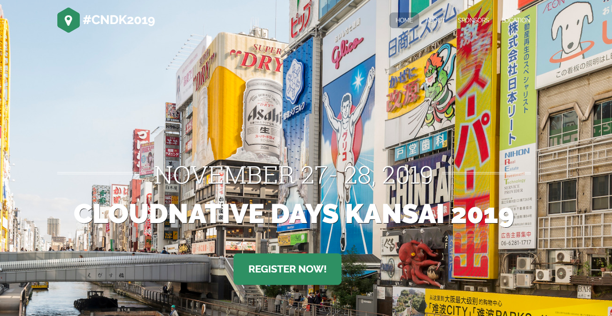
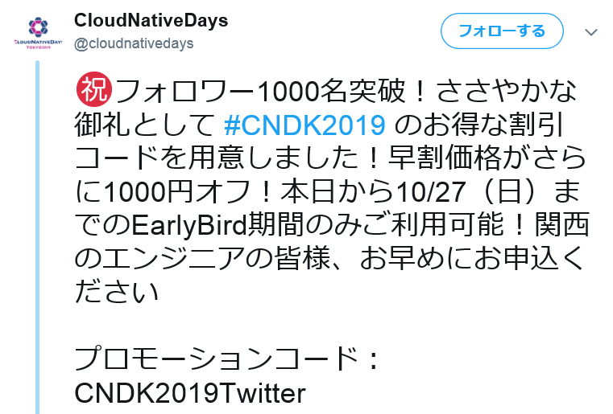

class: center, middle, inverse
## Windowsコンテナ入門

---
### whoami

.left-small[
    
]

.right-large[
- Kyohei Mizumoto(@kyohmizu)

- C# Software Engineer

- Interests
    - Docker/Kubernetes
    - Go
    - Security
]

---
### 今日話すこと

- コンテナの基本
- Windowsコンテナ
  - 概要
  - 実行環境
  - デモ（時間があれば）

---
class: center, middle, blue
## コンテナの基本

---
### コンテナとは

- 仮想化技術の一つ(コンテナ型仮想化)  
  ⇔ 仮想マシン(VM)
- 1つのホスト上に複数の分離空間を実現
  - 各コンテナをプロセスとして実行
  - それぞれの分離空間では異なるOSを実行可能
- ホストOSのカーネルを共有
- Dockerコンテナが主流

---
.left-half[
  仮想マシン
  
]

.right-half[
  コンテナ
  
]

.zoom0[
  <u><https://docs.microsoft.com/ja-jp/dotnet/architecture/microservices/container-docker-introduction/docker-defined></u>
]

---
### コンテナの特徴

仮想マシンとの相違

- 軽量(オーバーヘッドが少ない)
- 起動が高速
- 分離レベルはあまり高くない
  - セキュリティリスクに注意  
    → Rootlessコンテナの利用  
    → gVisorによるサンドボックス化

---
### コンテナを支える技術

.half[
- namespace
  - プロセスID、ユーザ等を分離
  - コンテナからホストのプロセス、ユーザは見えない
]

- cgroups
  - CPU、メモリ等のリソースを分離
  - リソースの使用量を制限

---
### Windowsでのコンテナ利用

.half[
- Docker Desktop for Windows
  - 仮想マシン上でコンテナ実行を実行
  - Hyper-Vを使用  
  <u><https://docs.docker.com/docker-for-windows/></u>
]

- Docker Toolbox（非推奨）
  - レガシーなデスクトッププログラム
  - Oracle VM VirtualBoxを使用  
  <u><https://docs.docker.com/toolbox/></u>

---
class: center, middle, blue
## Windowsコンテナ

---
### Windowsコンテナ

- コンテナでWindows Serverを実行
- Docker Desktop for Windowsでのみ実行可能

---
### ベースイメージ

- Windows Server Core
  - 従来の .NET framework アプリケーション用
- Nano Server
  - .NET Core アプリケーション用
- Windows
  - Windows API のフルセット
- Windows IoT Core
  - IoT アプリケーション用

※イメージは Docker Hub から取得可能

---
### 分離モード

.half-2[
- 2つの分離モード
  - プロセス分離（Process Isolation）
  - Hyper-V分離（Hyper-V isolation）
- 使用するイメージは共通
  - 実行時のオプションで選択する
]

.zoom1[
  <u><https://docs.microsoft.com/ja-jp/virtualization/windowscontainers/manage-containers/hyperv-container></u>
]

---
### プロセス分離

- ホストOS上のプロセスとしてコンテナを実行  
  - ホストOSとカーネルを共有
- 起動が早く、オーバーヘッドが少ない
- 開発、テスト用

<center></center>

---
### Hyper-V分離

- Hyper-Vの仮想マシン上でコンテナを実行  
  - ホストOSとカーネルを共有しない
- 分離レベルが高い
- 本番環境に適している

<center><center>

---
### コンテナホストの要件

.half-2[
.zoom2[
- Windows Server 2016、Windows Server 2019、  
  Windows 10 Professional または Enterprise
- Hyper-Vの機能が有効になっている（Hyper-V分離）
- OSが「C:」にインストールされいている（プロセス分離）
- BIOSで仮想化が有効になっている
  - ホストOSがHyper-V仮想マシンの場合、nested virtualization の有効化が必要
]
]

.zoom1[
  <u><https://docs.microsoft.com/ja-jp/virtualization/windowscontainers/deploy-containers/system-requirements></u>
]

---
### コンテナOSバージョンの互換性

.half-2[
- プロセス分離
  - ホストOSと同じバージョンのみ実行可能
- Hyper-V分離
  - ホストOSと同じか、古いバージョンのみ実行可能
]

.zoom1[
  <u><https://docs.microsoft.com/ja-jp/virtualization/windowscontainers/deploy-containers/version-compatibility></u>
]

---
### Windowsコンテナの実行

- プロセス分離

```powershell
docker run -it --isolation=process `
mcr.microsoft.com/windows/servercore:ltsc2019 cmd
```

- Hyper-V分離

```powershell
docker run -it --isolation=hyperv `
mcr.microsoft.com/windows/servercore:ltsc2019 cmd
```

---
class: center, middle, blue
## デモ

---
### 参考

.zoom1[
Microsoftドキュメント（翻訳に難あり）  
<u><https://docs.microsoft.com/ja-jp/virtualization/windowscontainers/></u>

＠ITの記事  
<u><https://www.atmarkit.co.jp/ait/articles/1902/07/news024.html></u>

Docker実践ガイド第2版  
<u><https://book.impress.co.jp/books/1118101052></u>
]

---
class: center, middle, blue
## 宣伝

---
<center><center>

<u><https://cloudnativedays.jp/cndk2019/></u>

---
<center><center>

.zoom1[
<u><https://twitter.com/cloudnativedays/status/1186154959517044736></u>
]

---
class: center, middle, blue
### ありがとうございました！