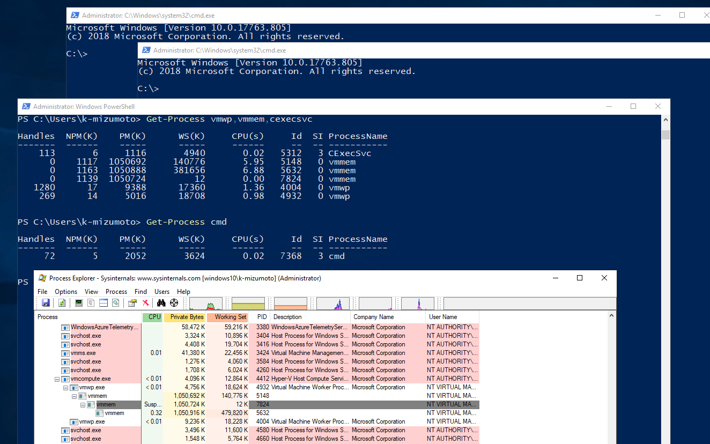
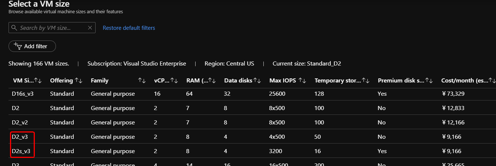
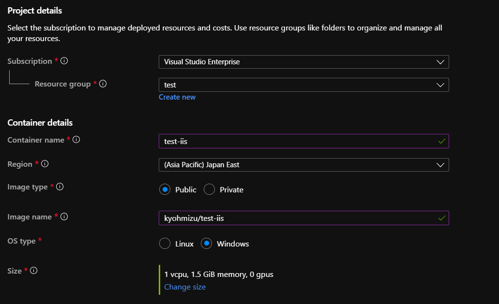
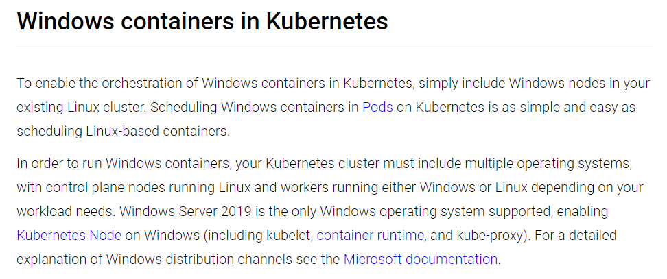

background-image: url(https://raw.githubusercontent.com/kyohmizu/items-for-presentation/master/bg-06.jpg)
background-size: cover
class: center, middle, white
## Windowsコンテナ入門

---
### whoami

.left-small[
    
]

.right-large[
- Kyohei Mizumoto(@kyohmizu)

- C# Software Engineer

- Interests
    - Docker/Kubernetes
    - Go
    - Security
]

---
### 今日話すこと

- コンテナの基本
- Windowsコンテナ概要
- デモ（時間があれば）

---
### 今日のゴール

- Windowsコンテナを何となく理解する
- Windowsコンテナを実行できるようになる

---
background-image: url(https://raw.githubusercontent.com/kyohmizu/items-for-presentation/master/bg-06.jpg)
background-size: cover
class: center, middle, white
## コンテナの基本

---
### コンテナ？

- 仮想化技術の一つ(コンテナ型仮想化)  
  ⇔ 仮想マシン(VM)
- 1つのホスト上に複数の分離空間(=コンテナ)を作成
  - ホストのプロセスとして動作
  - それぞれのコンテナでは異なるOSを実行可能
- ホストOSのカーネルを共有
- Dockerコンテナが主流

---
.left-half[
  仮想マシン
  
]

.right-half[
  コンテナ
  
]

.zoom0[
  <u><https://docs.microsoft.com/ja-jp/dotnet/architecture/microservices/container-docker-introduction/docker-defined></u>
]

---
### コンテナの特徴

仮想マシンとの相違

- 軽量(オーバーヘッドが少ない)
- 起動が高速
- 分離レベルはあまり高くない
  - セキュリティリスクに注意  
    → Rootlessコンテナの利用  
    → gVisorによるサンドボックス化

---
### コンテナを支える技術

.half[
- namespace
  - プロセスID、ユーザ、ファイルシステム等を分離
  - コンテナからホストのプロセス、ユーザは見えない
]

- cgroups
  - CPU、メモリ等のマシンリソースを分離
  - リソースの使用量を制限

---
### Windowsでのコンテナ利用

.half[
- Docker Desktop for Windows
  - 仮想マシン上でコンテナ実行を実行
  - Hyper-Vを使用  
  <u><https://docs.docker.com/docker-for-windows/></u>
]

- Docker Toolbox(非推奨)
  - レガシーなDockerデスクトッププログラム
  - Oracle VM VirtualBoxを使用  
  <u><https://docs.docker.com/toolbox/></u>

---
background-image: url(https://raw.githubusercontent.com/kyohmizu/items-for-presentation/master/bg-06.jpg)
background-size: cover
class: center, middle, white
## Windowsコンテナ

---
### Windowsコンテナ

- Windows Serverを実行するコンテナ
- Docker Desktop for Windowsで実行
  - Docker Toolboxでは実行不可
- 2つの分離モード
  - プロセス分離(Process Isolation)
  - Hyper-V分離(Hyper-V Isolation)

---
### ベースイメージ

- Windows Server Core
  - 従来の .NET frameworkアプリケーション用
- Nano Server
  - .NET Coreアプリケーション用
- Windows
  - Windows APIのフルセット
- Windows IoT Core
  - IoTアプリケーション用

※イメージは Docker Hub から取得可能

---
### コンテナホストの要件

.half-2[
.zoom2[
- Windows Server 2016、Windows Server 2019、  
  Windows 10 Professional または Enterprise
- コンテナ機能が有効になっている
- Hyper-Vの機能が有効になっている(Hyper-V分離)
- OSが「C:」にインストールされいている(プロセス分離)
- BIOSで仮想化が有効になっている
  - ホストOSがHyper-V仮想マシンの場合、nested virtualization の有効化が必要
]
]

.zoom1[
  <u><https://docs.microsoft.com/ja-jp/virtualization/windowscontainers/deploy-containers/system-requirements></u>
]

---
### 分離モード

.half-2[
.zoom2[
- 2つの分離モード
  - プロセス分離(Process Isolation)
  - Hyper-V分離(Hyper-V Isolation)
- 使用するイメージは共通
  - 実行時のオプション(--isolation)で選択する
- 既定値(オプションなしで実行した場合)
  - Windows Serverではプロセス分離
  - Windows 10ではHyper-V分離
]
]

.zoom1[
  <u><https://docs.microsoft.com/ja-jp/virtualization/windowscontainers/manage-containers/hyperv-container></u>
]

---
### プロセス分離

.zoom2[
- ホストOS上のプロセスとしてコンテナを実行  
  - ホストOSとカーネルを共有
  - ホストOSと同じバージョンのみ実行可能
- 起動が早く、オーバーヘッドが少ない
- 開発、テスト用
]

<center></center>

---
### プロセス分離

Windowsのコンテナ機能を使用

- ホストの実行プロセス
  - CExecSvc.exe(コンテナ実行エージェント)
- 1コンテナ当たりCExecSvcが1つ起動
- ホストからコンテナ内の実行プロセスを確認できる

---
### Hyper-V分離

.zoom2[
- Hyper-Vの仮想マシン上でコンテナを実行  
  - ホストOSとカーネルを共有しない
  - ホストOSと同じか、古いバージョンのみ実行可能
  - Hyper-Vマネージャーでは確認できない
- 分離レベルが高い
]

<center><center>

---
### Hyper-V分離

Hyper-Vの機能を使用

- ホストの実行プロセス
  - vmwp.exe(仮想マシンワーカー)
  - vmmem.exe(メモリ、CPUをコンテナ用に仮想化)
- 1コンテナ当たりvmwp、vmmemが1つずつ起動
- サポート用に1つのvmwp、2つのvmmemが常駐
- ホストからコンテナ内の実行プロセスを確認できない

---
### コンテナの実行

- プロセス分離

```powershell
docker run -it --isolation=process `
mcr.microsoft.com/windows/servercore:ltsc2019 cmd
```

- Hyper-V分離

```powershell
docker run -it --isolation=hyperv `
mcr.microsoft.com/windows/servercore:ltsc2019 cmd
```

---
### デモ

<center><center>

---
### Azure VMでの利用

.half-3[
.zoom2[
- VMサイズはv3を指定する
  - Nested Virtualizationを有効にするため
]

<center><center>
]

.zoom0[
<u><https://docs.microsoft.com/en-us/azure/virtual-machines/windows/nested-virtualization></u>  
<u><https://azure.microsoft.com/de-de/blog/introducing-the-new-dv3-and-ev3-vm-sizes/></u>
]

---
### Azure Container Instanceでの利用

<center><center>

---
### Kubernetesでの利用

.half-3[
.zoom2[
Windowsのノード上で、Windowsコンテナを利用可能
]

<center><center>
]

.zoom0[
<u><https://kubernetes.io/docs/setup/production-environment/windows/intro-windows-in-kubernetes/></u>
]

---
### Azure Kubernetes Serviceでの利用

.half-3[
.zoom2[
コンソール(Azure Cloud Shellなど)を使用

1. プレビューの拡張機能(aks-preview)をインストール
2. AKSクラスタを作成
   - Windows用に管理ユーザー名とパスワードを指定
3. Windows Serverのノードプールを追加
4. kubernetesリソースを作成
   - nodeSelectorに "beta.kubernetes.io/os": windows を設定
]
]

.zoom0[
<u><https://docs.microsoft.com/en-us/azure/aks/windows-container-cli></u>
]

---
### 参考

.zoom1[
Microsoftドキュメント（翻訳に難あり）  
<u><https://docs.microsoft.com/ja-jp/virtualization/windowscontainers/></u>

DockerHub - Docker Desktop for Windows  
<u><https://hub.docker.com/editions/community/docker-ce-desktop-windows></u>

＠ITの記事  
<u><https://www.atmarkit.co.jp/ait/articles/1902/07/news024.html></u>

Docker実践ガイド第2版  
<u><https://book.impress.co.jp/books/1118101052></u>
]

---
background-image: url(https://raw.githubusercontent.com/kyohmizu/items-for-presentation/master/bg-06.jpg)
background-size: cover
class: center, middle, white
## Thank you!